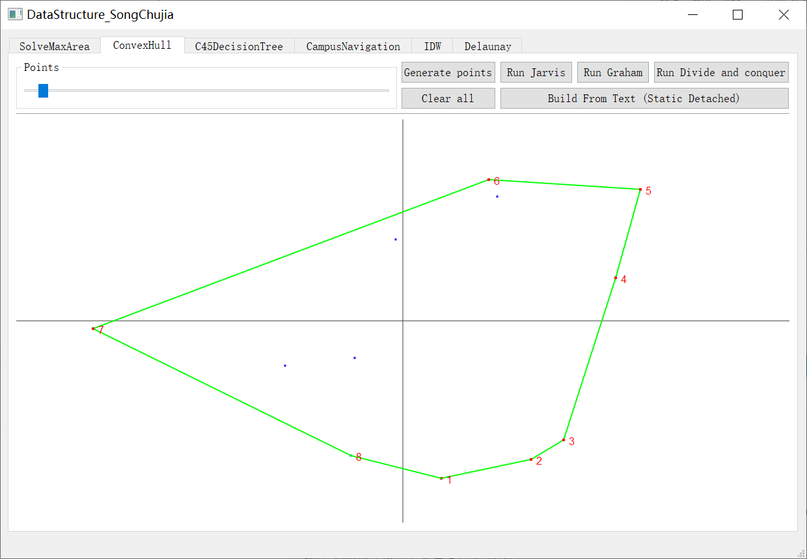
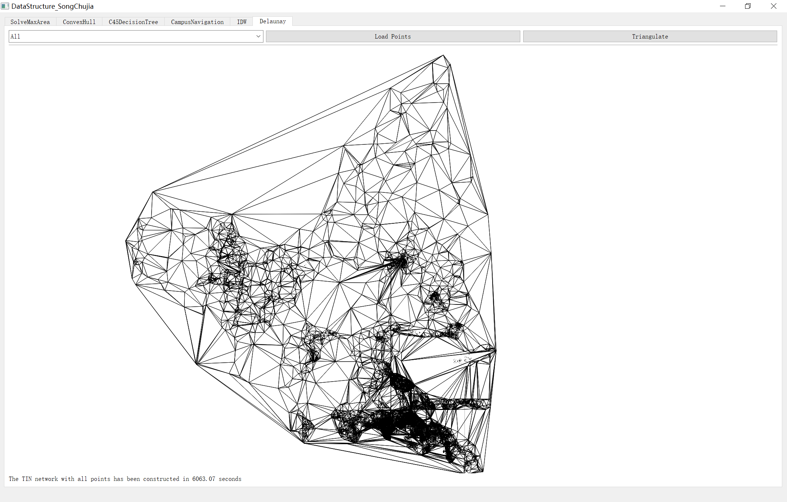
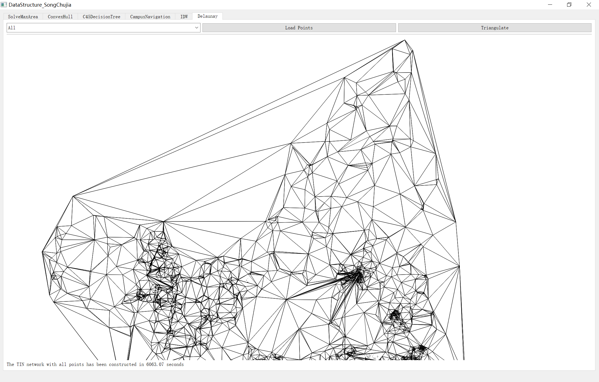
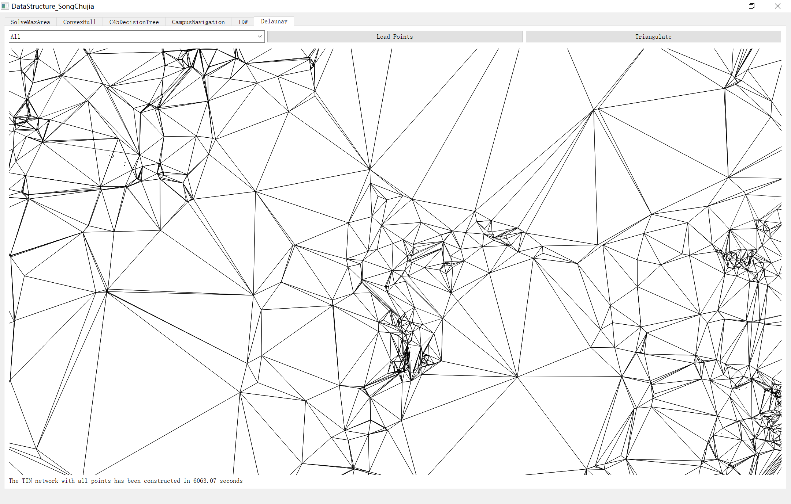

目录

[1 需求规格说明](#需求规格说明)

[1.1 棋盘最大涂色区域](#棋盘最大涂色区域)

[1.2 凸包求解](#凸包求解)

[1.3 决策树](#决策树)

[1.4 校园导航](#校园导航)

[1.5 反距离加权插值](#反距离加权插值)

[1.6 TIN的构建](#tin的构建)

[2 总体分析和设计](#总体分析和设计)

[2.1 棋盘最大涂色区域](#棋盘最大涂色区域-1)

[2.1.1 设计思想](#设计思想)

[2.1.2 规格约束](#规格约束)

[2.1.3 算法框架](#算法框架)

[2.2 凸包求解](#凸包求解-1)

[2.2.1 设计思想](#设计思想-1)

[2.2.2 规格约束](#规格约束-1)

[2.2.3 算法框架](#算法框架-1)

[2.3 决策树](#决策树-1)

[2.3.1 设计思想](#设计思想-2)

[2.3.2 规格约束](#规格约束-2)

[2.3.3 算法框架](#算法框架-2)

[2.4 校园导航](#校园导航-1)

[2.4.1 设计思想](#设计思想-3)

[2.4.2 规格约束](#规格约束-3)

[2.4.3 算法框架](#算法框架-3)

[2.5 反距离加权插值](#反距离加权插值-1)

[2.5.1 设计思想](#设计思想-4)

[2.5.2 规格约束](#规格约束-4)

[2.5.3 算法框架](#算法框架-4)

[2.6 TIN的构建](#tin的构建-1)

[2.6.1 设计思想](#设计思想-5)

[2.6.2 规格约束](#规格约束-5)

[2.6.3 算法框架](#算法框架-5)

[3 困难解决与编码关键](#困难解决与编码关键)

[3.1 界面与算法分离实现的思路](#界面与算法分离实现的思路)

[3.2 视窗变换与缩放至图层](#视窗变换与缩放至图层)

[3.3 鼠标拖动与缩放交互](#鼠标拖动与缩放交互)

[3.4 自适应决策树](#自适应决策树)

[3.5 自定义地图存储文件与动态交互地图实现](#自定义地图存储文件与动态交互地图实现)

[3.6 解析GeoJson文件](#解析geojson文件)

[3.7 高性能可视化与多线程安全保障](#高性能可视化与多线程安全保障)

[3.7.1 场景一 多次构建子线程导致并发冲突](#场景一-多次构建子线程导致并发冲突)

[3.7.2 场景二 未结束子线程导致内存泄漏](#场景二-未结束子线程导致内存泄漏)

[4 程序与算法分析](#程序与算法分析)

[4.1 棋盘最大涂色区域](#棋盘最大涂色区域-2)

[4.1.1 使用说明](#使用说明)

[4.1.2 运行效果](#运行效果)

[4.1.3 讨论分析](#讨论分析)

[4.2 凸包求解](#凸包求解-2)

[4.2.1 使用说明](#使用说明-1)

[4.2.2 运行效果](#运行效果-1)

[4.2.3 讨论分析](#讨论分析-1)

[4.3 决策树](#决策树-2)

[4.3.1 使用说明](#使用说明-2)

[4.3.2 运行效果](#运行效果-2)

[4.3.3 讨论分析](#讨论分析-2)

[4.4 校园导航](#校园导航-2)

[4.4.1 使用说明](#使用说明-3)

[4.4.2 运行效果](#运行效果-3)

[4.4.3 讨论分析](#讨论分析-3)

[4.5 反距离加权插值](#反距离加权插值-2)

[4.5.1 使用说明](#使用说明-4)

[4.5.2 运行效果](#运行效果-4)

[4.5.3 讨论分析](#讨论分析-4)

[4.6 TIN的构建](#tin的构建-2)

[4.6.1 使用说明](#使用说明-5)

[4.6.2 运行效果](#运行效果-5)

[4.6.3 讨论分析](#讨论分析-5)

[5 小结](#_Toc127471139)

# 需求规格说明

## 棋盘最大涂色区域

##### 【问题梳理】

有一个 n\*m 的棋盘，每个格子可能涂有不同的颜色。需要找到其中同一颜色面积最大的连续区域(按照四连通标准)，并求出其面积。

##### 【求解目标】

1.  按照四连通标准，寻找格网中相同属性值的连续区域。
2.  确定面积最大的连续区域，并求出其面积。

## 凸包求解

##### 【问题梳理】

给出一组平面上的点，构造出对应的凸包，并依次输出极点编号。基于界面编程将凸包可视化，要求算法代码和界面代码分离。

##### 【求解目标】

1.  构造输入点的凸包，求解极点并输出对应编号。
2.  可视化凸包和极点，算法与界面代码分离。

## 决策树

##### 【问题梳理】

DT_data.csv为样本数据，共14条记录，包含4维特征，分别为：Weather(天气), Temperature(温度), Humidity(湿度), Wind(风力)。其中Date(约会)为标签列，是预测的目标。实现ID3决策树，根据测试数据预测是否约会。实现C4.5决策树优化算法。

##### 【求解目标】

1.  根据多维样本数据构建ID3决策树。
2.  利用决策树对测试集进行分类。
3.  以信息增益率为指标，实现C4.5决策树算法。

## 校园导航

##### 【问题梳理】

建立至少包括10个以上的场所学校平面图，每个场所带有编号、坐标、名称、类别等信息，场所间可以有路径相通，且路长(耗时)可各不同。读取校园平面图。查询各个场所信息，找出从任意场所到达另一场所的最短路径(最佳路径)。

##### 【求解目标】

1.  自定义校园地图文件，以文件存储的形式记录地图数据。
2.  定义图数据结构，描述场所、路径、路长等基本元素。
3.  实现图的最短路径查找算法。

## 反距离加权插值

##### 【问题梳理】

实现反距离加权(IDW)的二维空间插值算法。构建基于离散点的插值空间，根据待插值点周围k临近点的属性值，按距离反比加权计算属性值。

##### 【求解目标】

1.  实现高效的二维平面的k邻近搜索算法。
2.  定义IDW计算方法，实现离散点插值算法。
3.  可视化插值空间和插值结果。

## TIN的构建

##### 【问题梳理】

实现一种Delaunay三角剖分算法，为洪山区POI数据构建TIN网。实现稳定、高效的三角网构建和可视化。

##### 【求解目标】

1.  实现Delaunay三角剖分算法，构建三角网。输入点集，得到边集。
2.  实现三角网的可视化。
3.  面对庞大数据，要能够实现高效、稳定、快速的构建和可视化。

# 总体分析和设计

## 棋盘最大涂色区域

### 设计思想

本题中的连续区域可定义为：任意格子及其邻接的连续区域构成的区域。“邻域的邻域”是一种递归的定义，故本题使用深度优先的递归搜索算法求解。

### 规格约束

棋盘采用vector\<vector\<char\>\>定义的二维数组。

设定边界条件为：

1) 超出棋盘范围

2) 格子颜色与起始颜色不同。

若满足边界条件，则返回0。

若当前格子的颜色与起始颜色相同，返回1 + “四方向”连通域的面积(此处执行递归)。为避免重复访问，可将访问过的格子置为-1。

ChessBoard类图：

图 21 ChessBoard类图

ChessBoard成员规格说明：

图 22 ChessBoard成员规格说明

### 算法框架

| **遍历二维棋盘数组。** 遍历棋盘，对每个尚未访问的单元进行连通域的深度优先搜索 递归函数返回的“四方向”连通域格子数 更新当前最大面积。 **所有格子访问完毕后返回最大面积。** |
|--------------------------------------------------------------------------------------------------------------------------------------------------------------------------|

## 凸包求解

### 设计思想

凸包求解是求解离散点的最小凸多边形的问题。边界求解的常见思路是按照一定的规则逐步扩张边界，即：从凸包上一点出发，遍历所有的点，满足凸包性质的保留，不满足凸包性质的舍弃。

根据凸包的封闭性，边界上任意一点必然连接两条边。是否为“凸壳”的顶点取决于与和构成的两条边和夹角是否满足外凸性。在边界扩张的过程中，子“凸壳”{,⋯,}的封闭性可能因为的加入而被打破。因此，凸包求解问题宜引入“栈”作为辅助数据结构。如果的加入打破了外凸性，则可以通过“出栈”的方式，删除“栈”顶点。

### 规格约束

凸包的性质为凸包求解算法提供了约束条件。

1.  封闭性： 凸包是一个封闭图形。
2.  外凸性： 凸包所有顶点都外凸，边界上任意两点的连线都在凸包内。
3.  单调性：
4.  从任一点出发，沿逆时针前进总是向左转，沿顺时针前进总是向右转。
5.  所有顶点均在凸包边界所在直线的一侧。逆时针遍历边，则点均在左侧。

ConvexHull类图：

根据外凸性和单调性，我们可以制定这样的判定规则：从起点出发，按逆时针前进(遍历所有的点)。若下一个点在当前的前进方向的左侧，则符合外凸性，可保留。若下一个点在当前的前进方向的右侧，则说明该点内凹，应当删去。

图 23结合单调性判别凹凸性

图 24 ConvexHull类图(包含凸包求解和三角剖分算法)

ConvexHull成员规格说明：

图 25 ConvexHull成员规格说明

### 算法框架

| **1确定凸包的起点。** 可将凸包的起点定为纵坐标最小的点。若有多个点，取其中横坐标最小的点。将其加入凸包列表，并作为极点。 **2 排序与编号**  连接极点与其余各点，按照极角从小到大的原则进行排序。如果角度相同，则距离近的点排列在前。可使用优先级队列进行排序。 **3 凹凸判别与连线**  将步骤2得到的队列从前往后依次出队，判断凸包列表顶部点、当前点与下一个点是否构成外凸的形状。 如果构成外凸，则保留当前点并将下一个点压入凸包栈中。 如果构成内凹，则说明当前点非凸包点，将当前点出栈并判断下一个点。 |
|-------------------------------------------------------------------------------------------------------------------------------------------------------------------------------------------------------------------------------------------------------------------------------------------------------------------------------------------------------------------------------------------------------------------------------------------------------------------------------------------------------|

## 决策树

### 设计思想

决策树算法是一种基于树形结构的算法。以树作为数据结构，数据集自顶向下经过不同的特征节点，被逐步地将细分，实现了机器学习中的分类任务。本题预测是否约会就是一种二分类问题，故可采用决策树类的算法得到分类标签。

决策树可以有多种构建方式，找到最优的构建方式有利于实现更好的分类。分类效果越好，整个系统的“混沌度”就越低，用信息熵这一指标衡量。分类会影响数据分布并提升信息“纯度”，系统熵值的降低可用信息增益这一指标衡量。

ID3决策算法就是利用贪心思想，计算熵值和信息增益，以当前数据集信息增益最大的特征作为根节点划分数据集，然后对子集以同样的方式递归地计算增益、选取特征、划分数据，直到子集类型全部相同或余下的特征不足以为止。

C4.5算法以信息增益率为指标，相较于ID3算法其特征选择指标无偏向性，更为可靠。因为信息增益值受到特征类别数的影响，类别数多的特征更容易实现信息增益，对最优特征的评判造成干扰。此外，C4.5还可实现连续值分类，按阈值剪枝等优化措施。

### 规格约束

特征编码：

使用std::map\<std::string, int\> strToInt和std::map\<int, std::string\> intToStr实现输入和输出的变换，以特征向量作为决策树的输入，将分类标签映射为文本输出。

信息熵：

信息熵增益：

内在信息(Intrinsic Information)：

信息增益率：

ID3和C4.5D类图：

图 26 ID3和C4.5D类图

ID3和C4.5D成员规格说明：

图 27 ID3成员规格说明

图 28 C4.5成员规格说明

### 算法框架

| **构建数据集**：读取样本数据集，转化为统一标准的特征向量。 **计算信息增益(率)**：计算每个特征的分类信息熵，进而计算信息增益(率)。 **选择特征**：选择信息增益(率)最高的特征作为根节点。 **划分数据集**：按照根节点特征的类别划分数据集，每种类别对应一个分支。 **递归建树**：每个分支的样本按照2\~4的步骤进行递归，构建决策树的分支。 停止条件：所有样本都属于同一类别，或者所有特征已经枚举完毕。 |
|---------------------------------------------------------------------------------------------------------------------------------------------------------------------------------------------------------------------------------------------------------------------------------------------------------------------------------------------------------------------------------------------------|

## 校园导航

### 设计思想

本题以图为主要数据结构，采用邻接表实现。用图的“顶点”和“边”存储校园的场所以及场所间的路径。采用基于贪心策略的Dijkstra算法求解两个场所间最短路径。Dijkstra算法不断以最邻近点作为“中转站”，更新从出发点到其余点的最短距离表。所有顶点访问完毕后，得到从起点出发至各点的最短距离。

### 规格约束

为降低空间复杂度并提高邻接点的查询效率，我以邻接表存储的方式实现图结构。为快速求得最邻近点以更新距离表，我建立以距离短为标准的优先级对列，其元素为std::pair\<int, int\>，用于存储距离和编号。更新最短距离表时，利用vector存储节点实现最优路径的保存。

输入：int型，包括：起点start，终点end。

输出：vector\<int\>型，存储从起点到终点的最短路径。

Graph类图：

图 29 Graph类图

Graph成员规格说明：

图 210 Graph成员规格说明

### 算法框架

| **定义存储结构和辅助数据结构** 建立图的邻接表 建立距离从小到大的优先级队列(用于获取最近邻接点) 建立起点到全部点的最短距离表 建立最短路径数组。 **将起点入队，更新最短距离表** **重复以下操作，直到队列为空** 出队一个点，作为当前点。 遍历邻接表，找到当前点的所有邻接点。 遍历邻接点，若能提供更优路径，则更新队列、距离列表和路径列表。    **返回路径列表** |
|---------------------------------------------------------------------------------------------------------------------------------------------------------------------------------------------------------------------------------------------------------------------------------------------------------------------------------------------------------------|

## 反距离加权插值

### 设计思想

我分两步实现高效的IDW插值：1) 使用KD树搜寻k近邻点 2) 根据IDW公式计算插值属性，平均时间复杂度达到。

树型结构可用于缩小搜索空间，提高搜索效率。为提高插值过程的整体效率，我使用KD树作为辅助数据结构，对二维平面进行递归分割、建树和搜索，得到k近邻点。之后再根据距离反比加权的插值公式，计算最终的属性值。

### 规格约束

界面程序提供的接口服务于数据流的加载和插值结果的可视化。提供了从文本加载和从GeoJson加载的两种接口。

1.  **void** generatePointsFromTextEdit(QString InitString, QString inputString); **//从文本进行IDW插值**
2.  **void** generatePointsFromGeoJson(QString inputString); **//从GeoJson文件进行IDW插值**

我将IDW插值算法封装为类，核心数据成员为IDWtree。这是一个KdTree\*类型的指针，用于实现KD树的建立和*k*近邻的搜索，其关键接口为

1.  **void** KdTree::k_nearest_neighbors(**const** CoordPoint& point, **size_t** k, KdNodeVector\* result, KdNodePredicate\* pred /\*=NULL\*/)

    IDW类图：

图 211 IDW类图

IDW类利用KD树的节点计算加权属性值，实现“反距离加权”插值的计算。

IDW成员规格说明：

图 212 IDW成员规格说明

本程序纯基于QT底层的绘图函数和计算几何的视窗变换原理，实现了GIS软件中的可交互、自适应数据范围的画布。主要提供两个接口：findBoundingBox和reshape，分别用于获取数据的外接矩形和自适应放缩屏幕坐标至全屏显示。

1.  **void** findBoundingBox(**const** QVector\<QPointF\>& points, QRectF& BoundingBox);  **//获取BoundingBox**
2.  **void** reshape(QVector\<QPointF\>& tmpPoints, QVector\<QPoint\>& winPoints, QRectF& BBox);**//自适应放缩至全屏显示**

计算距离：

计算距离反比的加权属性值：

### 算法框架

| KD树的流程如下： **建立KD树**： 选择数据点的维度作为分割维度。对于每个节点，使用按其所在维度空间的中位数进行递归分割，分别将左右(上下)两边的点放入两个子节点。 **搜索KD树**： 从根节点开始，根据当前节点的分割和目标点的向量关系决定搜索哪个子树。 **计算距离并保存结果**： 递归搜索直至遇到叶子节点，取k近邻节点并计算与节点的距离。 **插值**： 按照距离反比加权计算k近邻点的属性值，得到插值结果。 |
|------------------------------------------------------------------------------------------------------------------------------------------------------------------------------------------------------------------------------------------------------------------------------------------------------------------------------------------------------------------------------------------------------|

## TIN的构建

### 设计思想

使用逐点插入的Delaunay三角剖分算法，采用多线程技术，并行求解与可视化。在算法性能提升上考虑分治思想，参考分割合并法。

### 规格约束

ConvelHull(包含逐点插入Delaunay三角剖分算法)类图：

图 213 ConvexHull类图(包含凸包求解和三角剖分算法)

ConvelHull类(用于逐点插入Delaunay三角剖分算法)规格说明：

图 214规格说明

为实现三角网构建的多线程动态同步可视化，我定义了MyThread类：

图 215 Delaunay三角剖分使用的自定义子线程MyThread类

MyThread类规格说明：

图 216 MyThread类规格说明

### 算法框架

| **构建离散点的凸包** **初始化三角网** 利用分割半平面算法划分凸包，建立初始的三角网   **迭代以下步骤，直至所有数据点处理完毕：** 插入数据点P，在三角网中找出P落入的三角形T 连接P与T的三个顶点，生成新的三角形 使用LOP法则，优化三角网 处理边界和外围的三角形 |
|-------------------------------------------------------------------------------------------------------------------------------------------------------------------------------------------------------------------------------------------------------------|

# 困难解决与编码关键

## 界面与算法分离实现的思路

界面与算法分离是指将图形界面和数据处理逻辑分离，进行独立设计和实现的一种软件设计模式。这种模式使得软件具有更好的可维护性和可扩展性。可以在不改变算法逻辑的情况下更换图形界面，可以在不改变图形界面的情况下更换算法。

在这种模式中，图形界面和算法逻辑通过一种接口（如API）进行交互。图形界面负责呈现数据，而算法逻辑负责处理数据。这样，在图形界面上的更改不会影响算法逻辑，并且算法逻辑的更改也不会影响图形界面。

本程序实现了两种实现形式。第一种实现可以参考IDW插值的凸包可视化，这种方法是通过算法完整执行后，将结果数据包以函数返回值的形式传入界面的可视化模块。这种方法需要等待算法执行完毕，返回数据后才能进行可视化。

第二种方法可以参考凸包求解和Delaunay三角剖分的动态可视化，这种方法是利用多线程机制，通过指针传地址或信号槽绑定使算法和界面可以“共享”数据，进而使得程序可以在同时执行多个算法，并且可以实现对算法执行过程的动态可视化。

## 视窗变换与缩放至图层

数据分布对于图形的显示其实有很大影响，特别是本次实习在IDW插值和构建Delaunay三角网使用的测试数据geojson.json和TIN_data.csv记录的是真实的地理坐标。观察以下两组数据不难发现，地理坐标在数值上的差异很小，只是千分位的差异。

表格 31两种坐标量级差异会给可视化造成挑战

| 坐标类型     | 坐标样例                                                                                                                                                                                                 |
|--------------|----------------------------------------------------------------------------------------------------------------------------------------------------------------------------------------------------------|
| **屏幕坐标** | POLYGON ((0 0), (30 10), (10 30), (0 0))                                                                                                                                                                 |
| **地理坐标** | POLYGON ((114.13726247683384 22.57453153296995, 114.13726253585672 22.57362062876488, 114.1379932868094 22.57336379439826, 114.13860672275516 22.573820711775532, 114.13726247683384 22.57453153296995)) |

如此小的差异造成无法将地理坐标直接作为屏幕坐标进行显示。因此需要将千分位差异的地理坐标变换为屏幕可接受的、个位以上差异的屏幕坐标。而且还需要注意的是：屏幕坐标也有数值范围(如: 80006000)。如果变换后的屏幕坐标超出这一范围，就会落在显示区之外，用户只能拖动画布去查找这些图样。

综上所述，需要实现类似ArcGIS的“缩放至图层”的功能，才能实现好地理坐标数据的可视化(对应IDW插值和Delaunay三角网的题目)。为了轻量化程序，我决定不依赖二次开发库、QGIS等GIS工具和平台。通过实现视窗变换和“缩放至图层”的坐标变换函数，纯基于QT的基本绘图接口实现自适应画布。

首先，为了更好的显示，我将QT屏幕坐标原点(左上角, x轴向右, y轴向下)变换至屏幕中央(x轴向右, y轴向上)：

1.  QPoint DrawWidget::toScreenCoords(QPoint \&point)
2.  {
3.  QPoint p = QPoint(point.x(),-point.y());
4.  p.setX(p.x() \* \_scaleX + paper_x_);
5.  p.setY(p.y() \* \_scaleY + paper_y_);
6.  QPoint center(width()/2,height()/2);
7.  **return** p + center;
8.  }

    然后为了计算视窗变换的缩放比例，先计算平面数据的包围盒：

9.  **void** DrawWidget::findBoundingBox(**const** QVector\<QPointF\>& points, QRectF& BoundingBox)
10. {
11. **double** xMin = points[0].x();
12. **double** yMin = points[0].y();
13. **double** xMax = points[0].x();
14. **double** yMax = points[0].y();
15. **for** (**const** QPointF& p : points) {
16. xMin = std::min(xMin, p.x());
17. yMin = std::min(yMin, p.y());
18. xMax = std::max(xMax, p.x());
19. yMax = std::max(yMax, p.y());
20. }
21. BoundingBox.setLeft(xMin);
22. BoundingBox.setTop(yMin);
23. BoundingBox.setWidth(xMax - xMin);
24. BoundingBox.setHeight(yMax - yMin);
25. }

    最后，利用reshape函数，实现“缩放至图层”的自适应坐标变换函数：

26. **void** DrawWidget::reshape(QVector\<QPointF\> & tmp_points, QVector\<QPoint\>& winPoints, QRectF& BBox)
27. {
28. **double** ymax, ratioy, xmax, ratiox, ratio;
29. findBoundingBox(tmp_points, BBox);
30. ratiox = windowBoardX / BBox.width();
31. ratioy = windowBoardY / BBox.height();
32. QPointF \_center = BBox.center();
33. (ratioy \> ratiox) ? ratio = ratiox : ratio = ratioy;
34. **for** (**int** i = 0; i \< tmp_points.size(); ++i)
35. winPoints.push_back(QPoint(tmp_points[i].rx() \* ratio - (_center.x() \* ratio), tmp_points[i].ry() \* ratio - (_center.y() \* ratio)));
36. }

需要注意的是，视窗变换不仅需要比率变换(使数据点显示的间距合理)，还需要进行平移改正，这样才能将全部数据点显示在屏幕正中央。

由此，可以将洪山区的TIN网自适应地显示在屏幕中央，效果如下：

图 31自适应全屏居中显示地理数据

## 鼠标拖动与缩放交互

一个拖动过程中包含两个重要坐标：鼠标初次按压的坐标Start和鼠标当前坐标End。两个坐标的差值可用于横纵坐标偏移量的计算，进而修正屏幕坐标，使几何图形跟随鼠标移动。画布缩放通过监听滚轮事件实现，将屏幕坐标乘以滚轮转动的角度参数实现缩放变换。

我在实现拖动功能时遇到了两个难点需求：实时显示和连续拖动。实时显示即拖动过程中的每个位置都应绘制处理，画面应当是“连续移动”而非“跳跃移动”的。连续拖动即每次拖动都是在上一次拖动状态的基础上实现，这意味着需要进行坐标增量累计。

我通过在mouseMoveEvent中进行最终坐标增量的推算，确保坐标增量随鼠标的移动而更新，实现了拖动的实时显示。若在mouseReleaseEvent中推算坐标增量则只会在鼠标释放后更新显示。

1.  **void** DrawWidget::mouseMoveEvent(QMouseEvent\* event)
2.  {
3.  //mouseMoveEvent记录拖动过程释放鼠标的最终坐标
4.  **if** (is_mouse_left_btn_down\_ == **true**) {
5.  //计算相对于本次拖动初始位置的偏差
6.  paper_x\_ = event-\>pos().x() - start_press_x;
7.  paper_y\_ = event-\>pos().y() - start_press_y;
8.  update();
9.  }
10. }

我通过累计坐标增量实现连续拖动。一次完整的拖动影响了下一次拖动的起算位置，相当于改变了坐标轴。因此，每次拖动的起算坐标应当基于当前坐标增量，正如代码所示：

图 32鼠标拖动的坐标增量推算

1.  **void** DrawWidget::mousePressEvent(QMouseEvent\* event)
2.  {
3.  //mousePressEvent记录拖动过程中初次点击的坐标
4.  **if** (event-\>buttons() & Qt::RightButton) {
5.  
6.  is_mouse_left_btn_down\_ = **true**;
7.  
8.  }
9.  **else** **if** (event-\>buttons() & Qt::LeftButton) {
10. //鼠标按下的坐标，相当于拖动过程的起点
11. mouse_down_pos\_ = event-\>pos();
12. //减当前变化量paper_x_,paper_y_是为了在多次拖动的过程中累计坐标变化量，可以实现连续地拖动
13. start_press_x = mouse_down_pos_.x() - paper_x_;
14. start_press_y = mouse_down_pos_.y() - paper_y_;
15. is_mouse_left_btn_down\_ = **true**;
16. }
17. 
18. }

可以通过鼠标拖动、滚轮放缩，查看三角网、数据点分布的细节：

图 33实现可平移、可缩放的地图画布，用以查看三角网的细节

## 自适应决策树

为实现自适应地构建决策树，避免在代码中存储数据，可以利用vector和map作为数据结构。通过建立字符串(特征类别)与特征向量间的映射(vector\<int\>)关系，简化了决策树的输入。

1.  //读取数据
2.  **if** (relPath.isEmpty())
3.  **return**;
4.  strs = read_csv(relPath.toStdString());
5.  //特征向量为vector\<int\>型，数据集为特征向量构成的矩阵
6.  std::vector\<std::vector\<**int**\>\> featureVectors(strs.size()-1, std::vector\<**int**\>(strs[0].size()));
7.  //记录表头然后除表头
8.  names = strs[0];
9.  strs.erase(strs.begin());
10. //构建特征向量
11. **for** (**int** j = 0; j \< strs[0].size(); j++) {
12. //建立每个特征的类别与特征向量取值之间的映射
13. std::map\<std::string, **int**\> strToInt;
14. std::map\<**int**, std::string\> intToStr;
15. **int** nextInt = 0;
16. **for** (**int** i = 0; i \< strs.size(); i++) {
17. **const** std::string& str = strs[i][j];
18. **if** (strToInt.count(str) == 0) {
19. strToInt[str] = nextInt;
20. intToStr[nextInt++] = str;
21. }
22. featureVectors[i][j] = strToInt[str];
23. }
24. mdict.push_back(strToInt);
25. reverse_dict.push_back(intToStr);
26. }
27. Tree.setDimension(names.size()-1);
28. //分离特征和标签
29. std::vector\<std::vector\<**int**\>\> input = getFirstNColumns(featureVectors, featureVectors[0].size() - 1);
30. //建立C4.5D决策树
31. **for** (**int** i = 0; i \< input.size(); i++)
32. {
33. Tree.PushData(&input[i][0], featureVectors[i][featureVectors[0].size() - 1]);
34. }
35. Tree.Build();

## 自定义地图存储文件与动态交互地图实现

我设计实现了一种自定义的地图存储文件，用于存储校园的：栅格底图、场所名称、场所坐标、路径及其权重。文件的存储规范如下表所示：

表格 32自定义地图文件的存储格式规范

| 位置    | 内容                 |
|---------|----------------------|
| 第一行  | 栅格底图的路径       |
| 第二行  | 场所数n 路径数m      |
| 往后n行 | 场所编号 场所名称    |
| 往后n行 | 场所编号 场所坐标    |
| 往后m行 | 起点 终点 路径的权重 |

Map文件包含了校园地图的全部信息，可用记事本编辑。加载地图后，程序会动态地读取地图文件、加载交互控件。用户只需按照上述格式填写信息即可制作、使用新的地图，无需修改程序中的任何内容，具有较好的可拓展性。

图 34自定义地图文件存储效果

加载上述格式的地图可在显示界面得到如下效果：

图 35加载地图文件，生成可交互地图

## 解析GeoJson文件

我使用rapidjson进行GeoJson的解析。只需添加一个cpp文件就可以构造Json访问对象，读取GeoJson中所有的点数据及其高程，用于构造IDW插值空间。关键代码如下所示：

1.  **double** x, y;
2.  // 构造json解析对象
3.  rapidjson::Document d;
4.  d.Parse(str.c_str());
5.  QVector\<QPointF\> tmp_points;
6.  
7.  **int** numLineStrings = d["features"].Size();
8.  std::vector\<**int**\> numPointsCounts;
9.  std::vector\<std::vector\<**double**\>\> pointForBuild;
10. //读取所有LineString
11. **for** (**int** i = 0; i \< numLineStrings; i++)
12. {
13. **int** pointCounts = 0;
14. // 获取properties和geometry
15. **const** Value& properties = d["features"][i]["properties"];
16. **const** Value& geometry = d["features"][i]["geometry"];
17. **const** Value& coords = geometry["coordinates"];
18. 
19. // 从properties中解析ID和ELEV高程
20. **int** id = properties["ID"].GetInt();
21. **double** elev = properties["ELEV"].GetDouble();
22. 
23. // 解析LineString上的所有点
24. **for** (pointCounts = 0; pointCounts \< coords.Size(); pointCounts++) {
25. std::vector\<**double**\> coord;
26. x = coords[pointCounts][0].GetDouble();
27. y = coords[pointCounts][1].GetDouble();
28. tmp_points.push_back(QPointF(x, y));
29. pointForBuild.push_back(coord = { x, y, elev });
30. }
31. numPointsCounts.push_back(pointCounts);
32. }

## 高性能可视化与多线程安全保障

本次实习的附加题TIN需要加载共计151110条数据，如果采用单线程的设计模式，则需要在数据读取、三角剖分、绘制三角网等步骤执行完毕才能看到可视化的结果。直到三角剖分算法执行完毕，单线程程序将一直处于“僵死”状态，为程序的稳定性造成极大的隐患。

针对上述问题，我构建多线程的程序，实现了三角网可视化与三角剖分的同步。通过多线程与内存共享机制，本程序不仅可以看到构建三角网的动态过程，而且可以在构建三角网的过程中稳定地、流程地进行界面交互，甚至可以在等待三角网构建的时候，执行其他的功能。多线程程序的稳定性也更强，对子线程的暂停、终止等操作不会影响主线程正常运转。

首先，我为三角剖分定义了线程类MyThread

1.  **class** MyThread : **public** QThread
2.  {
3.  Q_OBJECT
4.  
5.  **public**:
6.  **explicit** MyThread(ConvexHull\* hull, QList\<Triangle\>\* tr, QObject\* parent = nullptr) : QThread(parent) { myHull = hull; DelaTins = tr; }
7.  **void** run()
8.  {
9.  QTime timer;
10. timer.start();
11. //建立初始三角网
12. InitTin = (\*myHull).GetInitTin((\*myHull).getHull());
13. //逐点插入构建精细三角网
14. (\*DelaTins) = (\*myHull).getDelaunay((\*myHull).getTins(), (\*myHull).getDispts());
15. **int** elapsedTime = timer.elapsed();
16. **float** elapsedTimeInSeconds = elapsedTime / 1000.0f;
17. emit resultReady(elapsedTimeInSeconds);
18. }
19. ConvexHull\* myHull;
20. QList\<Triangle\>\* DelaTins;
21. QList\<Triangle\> InitTin;
22. signals:
23. **void** resultReady(**float**);
24. **public** slots:
25. **void** sleepAndWait();
26. **void** killThread();
27. };

    用户点击Triangulate按钮，初始化线程并传入指针(共享内存，同步可视化)：

28. **thread** = **new** MyThread(&myHull, \&DelaTins, **this**);
29. connect(**thread**, SIGNAL(resultReady(**float**)), **this**, SLOT(tinFinished(**float**)));
30. **thread**-\>start(); //执行子线程

    除此之外，还需要为多线程的程序建立保险机制，以两个场景为例：

### 场景一 多次构建子线程导致并发冲突

在三角剖分的过程中，用户可能因为不愿等待而多次点击Triangulate按钮。这种操作会创造出多个子线程，访问并修改同一内存，进而导致并发冲突。

针对这一问题，我在新建线程操作前增设了对当前线程的检查。若存在，则终止运行，然后析构。如下所示：

1.  **void** DrawWidget::triangulate(QString numTinPoints)
2.  {
3.  **if** (onrun) {
4.  **thread**-\>terminate();
5.  **delete** **thread**;
6.  onrun = 0;
7.  }
8.  DelaTins.clear();
9.  **thread** = **new** MyThread(&myHull, \&DelaTins, **this**);
10. connect(**thread**, SIGNAL(resultReady(**float**)), **this**, SLOT(tinFinished(**float**)));
11. **thread**-\>start();
12. onrun++;
13. }

### 场景二 未结束子线程导致内存泄漏

用户可能因为不愿等待而提前结束程序。这时关闭窗体虽然会结束主线程，但子线程仍在运行中，会非法访问导致内存泄漏。

针对这一问题，我补充了主线程的析构函数。关闭窗体会先执行析构函数，结束并妥善处理子线程，然后再结束主线程、清理内存，保障了程序的安全。

1.  \~DrawWidget() { **if** (onrun) { **thread**-\>terminate(); **delete** **thread**; } };

# 程序与算法分析

## 棋盘最大涂色区域

### 使用说明

打开Data For Test/Chessboard/Chess_data.txt，加载棋盘文件：

图 41加载棋盘文件

### 运行效果

加载棋盘文件后，

图 42棋盘加载效果

点击Sovle进行求解，最大区域使用黑色框线和格网标识，底部提示求解的同色区域的最大面积。

图 43求解最大面积并使用格网和文字提示标识

### 讨论分析

假设棋盘格的尺寸为：，栈中存放的格子数最多为：。每个格子在访问后会标记为-1，每个格子最多访问1次，因此时空复杂度均为：

| 时间复杂度 | 空间复杂度 |
|------------|------------|
|            |            |

## 凸包求解

### 使用说明

使用逻辑为：先点击Generate Points随机生成离散点，再点击算法求解按钮(对应下图标签②的位置)。

本程序还支持从文本构造凸包，可视化与算法分离求解凸包。凸包求解算法同时用于可视化IDW插值的结果，请点击Build From Text (Static Detached)察看。

图 44 凸包求解动态演示

### 运行效果

生成样本点后执行算法，可见凸包顶点和边界被高亮，并且其一侧有从1开始的数字编号，如下图所示：

图 45凸包求解结果

点击Build From Text (Static Detached)跳转至IDW插值的界面，可在文本框中输入文本进行构造。初始时会自动提供测试样例，点击Text再点击Build From Text即可看到凸包求解的结果。

图 46凸包求解算法用于可视化IDW插值的结果

### 讨论分析

Javis算法相当于以不同的点作为极点向其他点扫描，而Graham算法则是取纵坐标最小的点作为固定的极点进行扫描，Divide and conquer算法使用了递归和分治的思想，时间复杂度依次为：

| 复杂度     | Javis | Graham | Divide and conquer |
|------------|-------|--------|--------------------|
| 时间复杂度 |       |        |                    |

## 决策树

### 使用说明

点击Load Train Data，打开Data For Test/C45DecisionTree/DT_data.csv，加载训练数据，用于建树：

图 47加载决策树的训练集

点击Load Test Data，打开Data For Test/C45DecisionTree/DT_data_test.csv，加载测试数据，用于测试决策树的分类功能：

图 48加载决策树的测试集

加载训练和测试数据完毕后，点击Predict可视化预测结果。

### 运行效果

训练数据表单：

图 49可视化训练数据表单

测试数据表单：

图 410可视化测试数据的表单

预测结果可视化：

图 411高亮显示预测结果

### 讨论分析

假设训练集大小为 *n*，所有特征的数量为 *m*，任意一个特征的类别最多为 *k*，则ID3与C4.5D决策树的时间复杂度为：

其中为采用暴力排序算法的时间复杂度，若将排序算法进行优化，时间复杂度可以达到：

## 校园导航

### 使用说明

点击Open Map File，加载Data For Test/CampusMap/CUG.map

图 412加载自定义校园地图

本程序提供两种最优路径的查寻方式：

①使用菜单栏搜索，从菜单选中起点和终点，点击Search按钮查找。

②在地图中依次点击起点和终点，自动求解最优路径

最优路径求解完毕，程序会以黄色高亮可视化路径并且在底部提示最优路径从起点到终点依次经过的场所。

图 413提供搜索查询和地图交互查询

### 运行效果

加载地图文件，地图可缩放、可拖动、可交互，如下图所示：

图 414可交互校园地图

菜单选择起点与终点，程序以“黄色高亮”展示最优路径，且底部文字提示：

图 415使用菜单栏搜索查询最短路径

鼠标点击起点与终点，程序以“黄色高亮”展示最优路径，且底部文字提示：

图 416以黄色高亮和底部文字提示展现最优路径

### 讨论分析

Dijkstra算法的时间复杂度为。

程序使用优先级队列作为辅助数据结构，寻找最近的邻接顶点只需要向优先级队列插入邻接顶点然后出队。参考优先级队列插入元素的时间复杂度为，我认为平均时间复杂度可以达到。

| 复杂度         | 平均复杂度 | 最坏复杂度 |
|----------------|------------|------------|
| **时间复杂度** |            |            |

## 反距离加权插值

### 使用说明

本程序提供两种数据输入方式，一种是通过文本构建插值空间，需要在Text For Build(3D)文本框中按格式输入，另一种是通过GeoJson文件构建插值空间，需要点击BuildFromGeoJson加载Json文件。

上述两种数据输入的量纲和量级不同，为此本程序提供两种测试样例模板，点击Text或GeoJson即可查看。如需另行测试，请保持模板测试样例的格式，数量级和取值范围与模板测试样例接近为宜。

图 417提供两种数据格式的IDW插值

在Text For Build(3D)中填入已知点数据，点击Text填入未知点坐标, 点击BuildFromText执行IDW插值，并进行可视化：

图 418从文本构造插值空间并插值

点击GeoJson填写未知点坐标，点击BuildFromGeoJson加载json文件，并执行IDW插值与可视化：

图 419从GeoJson构造插值空间并插值

可使用鼠标滚轮放缩、鼠标左键拖动画布，查看可视化的细节。

图 420鼠标拖动、放缩以查看插值细节

### 运行效果

可视化插值效果，下图为从文本构建的插值效果：

图 421插值与可视化

下图为从GeoJson文件构造的插值效果：

图 422使用GeoJson数据构建插值空间

可使用鼠标滚轮放缩、鼠标左键拖动画布，查看插值的细节。

图 423使用鼠标拖动、放缩查看插值细节

### 讨论分析

IDW插值算法的核心开销在于k近邻搜索，找到邻近的k个点后，带入公式即可。因此我认为时间复杂度主要体现在KD树为数据结构的k近邻搜索算法。

假设n为KD树的节点数，即插值空间已知点的个数，则有：

| 操作       | 平均复杂度 | 最坏复杂度 |
|------------|------------|------------|
| 新增节点   |            |            |
| 删除节点   |            |            |
| 最近邻搜索 |            |            |

## TIN的构建

### 使用说明

第一个菜单栏中选择构建所需的点数，然后点击Load Points加载Data For Test/TinData/TIN_data.csv。若不选择构建所需的点数，默认加载全部的点：

图 424菜单栏选择加载的点数，然后点击Load Points加载离散点数据

若后期测试中需要修改加载的点数，请在菜单栏中选择点数，再次点击Load Points，即可完成修改。

图 425可在运行时调整加载的点数，再次点击Load Points即可完成更改

### 运行效果

加载洪山区样本点的全部数据并构建凸包，如下图所示：

图 426加载离散点并构建凸包

可在算法执行时，同步查看三角剖分的动态过程：

图 427动态地可视化算法执行过程

在三角网构建过程中，可鼠标左键拖动画布、滚轮放缩，查看三角网的细节：

图 428鼠标拖动、缩放以查看三角网构建的细节

按如下图所示操作，三角网构建完成后程序会在底部提示时间开销。使用5000个点构建三角网，用时15.241s，如下图所示：

图 429完成构建会提示算法的时间开销

使用500个点构建三角网，用时0.356s，如下图所示：

图 430使用500个点构造的三角网

使用10000个点构建三角网，用时54.366s，如下图所示：

图 431使用10000个点构建三角网

使用20000个点构建三角网，用时156.023s，如下图所示：

图 432使用20000个点构建三角网

使用全部151109个点构建三角网，用时6063.07s，约1小时40分钟如下图所示(横纵穿过的直线为xy坐标轴)：

图 433全局效果

图 434左上角效果

图 435上部效果

图 436中部效果

图 437下部效果

### 讨论分析

本程序实现了逐点插入的三角剖分算法。最好情况下，输入数据*n*点共圆，时间复杂度可达到。最坏情况下，需要对每个点进行三角剖分，时间复杂度为。采用逐点插入法进行三角剖分的平均时间复杂度为。

| 复杂度     | 最好复杂度 | 平均复杂度 | 最坏复杂度 |
|------------|------------|------------|------------|
| 时间复杂度 |            |            |            |
